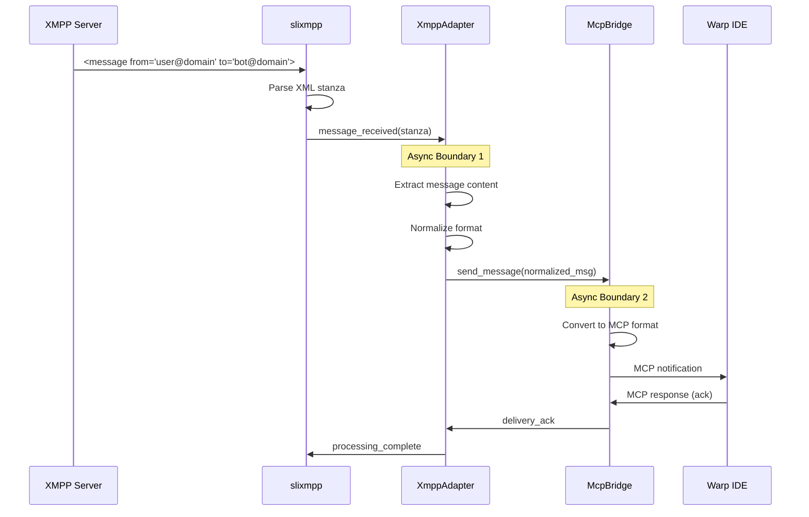
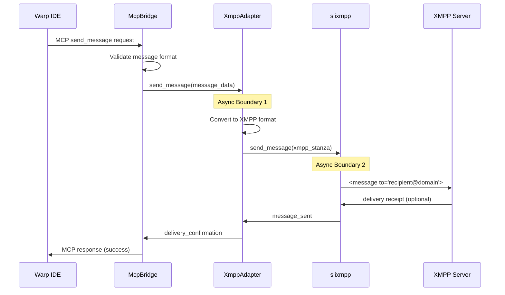
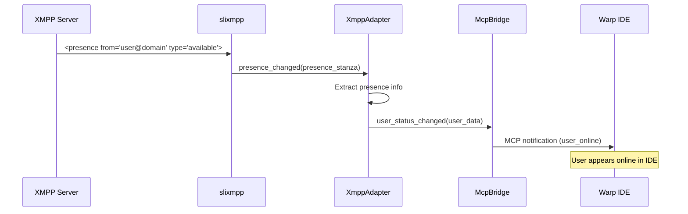

# XMPP-MCP Bridge Architecture

## Overview

This document defines the architecture and component interfaces for the XMPP-MCP bridge system that connects XMPP messaging to Warp IDE through the Model Context Protocol (MCP).

## Component Architecture

```
┌─────────────┐    ┌──────────────┐    ┌──────────────┐    ┌─────────────┐    ┌──────────┐
│    XMPP     │◄──►│   slixmpp    │◄──►│  XmppAdapter │◄──►│  McpBridge  │◄──►│ Warp IDE │
│   Server    │    │   Library    │    │              │    │             │    │          │
└─────────────┘    └──────────────┘    └──────────────┘    └─────────────┘    └──────────┘
```

### Components

1. **XMPP Server**: External XMPP messaging server (e.g., Prosody, ejabberd)
2. **slixmpp**: Python XMPP library handling protocol-level communication
3. **XmppAdapter**: Adapts XMPP messages to internal format
4. **McpBridge**: MCP protocol bridge connecting to Warp IDE
5. **Warp IDE**: Target application consuming messages via MCP

## Sequence Diagrams

### Message Flow: Incoming XMPP Message



### Message Flow: Outgoing Message from Warp IDE



### Presence and Status Updates



## Async Boundaries and Back-Pressure Strategy

### Async Boundaries

1. **Boundary 1: slixmpp ↔ XmppAdapter**
   - **Location**: Between protocol handling and business logic
   - **Mechanism**: `asyncio.Queue` with configurable buffer size
   - **Purpose**: Decouple XMPP protocol timing from message processing

2. **Boundary 2: XmppAdapter ↔ McpBridge**
   - **Location**: Between XMPP-specific logic and MCP protocol
   - **Mechanism**: `asyncio.Queue` with back-pressure handling
   - **Purpose**: Allow independent scaling of XMPP and MCP operations

### Back-Pressure Strategy

#### Buffer Management
```python
# Configuration
MAX_QUEUE_SIZE = 1000
PRIORITY_QUEUE_SIZE = 100
WARNING_THRESHOLD = 0.8  # 80% capacity

# Queue types
incoming_messages = asyncio.Queue(maxsize=MAX_QUEUE_SIZE)
priority_messages = asyncio.Queue(maxsize=PRIORITY_QUEUE_SIZE)
outgoing_messages = asyncio.Queue(maxsize=MAX_QUEUE_SIZE)
```

#### Back-Pressure Handling

1. **Queue Monitoring**
   ```python
   async def monitor_queue_health():
       while True:
           queue_size = incoming_messages.qsize()
           if queue_size > MAX_QUEUE_SIZE * WARNING_THRESHOLD:
               logger.warning(f"Queue approaching capacity: {queue_size}/{MAX_QUEUE_SIZE}")
               await apply_back_pressure()
   ```

2. **Message Prioritization**
   - **High Priority**: Presence updates, system messages, direct messages
   - **Medium Priority**: Group chat messages, notifications
   - **Low Priority**: Historical data, bulk operations

3. **Drop Strategies**
   - **FIFO Drop**: Remove oldest low-priority messages when queue full
   - **Rate Limiting**: Temporarily slow message acceptance rate
   - **Circuit Breaker**: Temporarily reject new messages if system overloaded

4. **Flow Control**
   ```python
   class BackPressureManager:
       def __init__(self):
           self.current_load = 0.0
           self.max_load = 1.0

       async def should_accept_message(self, message_priority: Priority) -> bool:
           if self.current_load < 0.7:
               return True
           elif self.current_load < 0.9:
               return message_priority >= Priority.MEDIUM
           else:
               return message_priority >= Priority.HIGH
   ```

### Performance Targets

- **Latency**: < 50ms for message processing under normal load
- **Throughput**: Handle 1000+ messages/second peak load
- **Memory**: Bounded memory usage with configurable limits
- **Recovery**: Automatic recovery from temporary overload conditions

## Error Handling and Resilience

### Connection Recovery
```python
class ConnectionManager:
    async def handle_xmpp_disconnect(self):
        # Exponential backoff reconnection
        await self.reconnect_with_backoff()
        # Replay buffered messages
        await self.replay_pending_messages()

    async def handle_mcp_disconnect(self):
        # Buffer outgoing messages
        self.buffer_outgoing = True
        # Attempt reconnection
        await self.reconnect_mcp()
```

### Message Persistence
- Critical messages buffered to disk during outages
- Automatic replay on reconnection
- Duplicate detection for message replay scenarios

## Security Considerations

### Authentication
- XMPP SASL authentication
- MCP authentication tokens
- Certificate validation for TLS connections

### Message Validation
- Input sanitization for all incoming messages
- JSON schema validation for MCP messages
- Rate limiting per user/channel

### Data Privacy
- End-to-end encryption support (OMEMO)
- Message content logging controls
- PII scrubbing for logs and metrics
